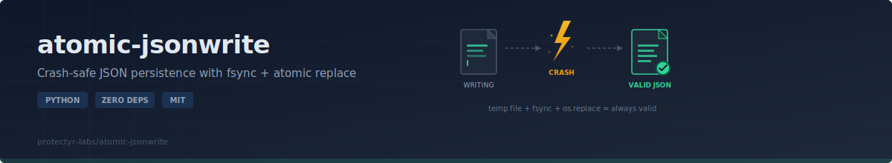
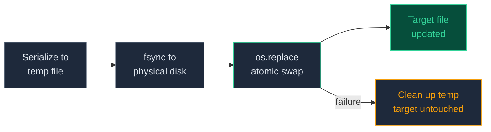

<p align="center">
  
</p>

# atomic-jsonwrite

If you persist state as JSON -- agent checkpoints, config files, pipeline progress -- you have a silent corruption risk. The standard pattern (`json.dump()` with `open('w')`) can leave a zero-byte or half-written file when the process crashes, the power fails, or the OS kills your process mid-write. Every downstream reader then hits `JSONDecodeError` and the cascade begins. This library replaces that pattern with a three-step write (temp file, fsync, atomic rename) so the file on disk is always either the previous valid version or the complete new version. Never partial, never corrupt. Zero dependencies, works on Windows and POSIX.

[](https://github.com/protectyr-labs/atomic-jsonwrite/actions)
[](LICENSE)
[](https://python.org)
[]()

## Use Cases

**Agent state persistence** -- Your AI agent writes its state to a JSON file between runs. If the process crashes mid-write, the state file must not be corrupted.

**Configuration hot-reload** -- Multiple processes read a shared config file. When updating, the file must be either the old version or the complete new version -- never partial.

**Pipeline checkpointing** -- A data pipeline saves progress to JSON after each stage. If the pipeline crashes, it can resume from the last valid checkpoint.

## Quick Start

```bash
pip install atomic-jsonwrite
```

```python
from atomic_jsonwrite import atomic_write, atomic_read

atomic_write("state/config.json", {"version": 3, "debug": True})
# => writes temp file, fsync, os.replace -- crash-safe

data = atomic_read("state/config.json")
print(data["_written_at"])  # "2026-04-12T15:30:00+00:00" (auto-injected)
print(data["version"])      # 3

atomic_read("missing.json") # => None (never raises)
```

## Write Pipeline



The temp file is created **in the same directory** as the target. This guarantees `os.replace()` operates within a single filesystem, which is a requirement for atomic rename on both NTFS and POSIX. On Windows, `os.replace()` can transiently fail if another process holds the file open, so the library retries up to 5 times with backoff.

## Why Not Just json.dump()?

You could write this in 20 minutes. But you will get at least one of these wrong:

- **`flush()` is not enough** -- data can sit in the OS buffer after flush. `fsync()` forces it to the physical disk. Without fsync, a power failure loses your data.
- **`os.rename()` fails on Windows** if the target exists. `os.replace()` is atomic on both NTFS and POSIX. Most "atomic write" snippets on Stack Overflow use `os.rename()` and silently break on Windows.
- **Temp file in the same directory** -- `os.replace()` across filesystems (e.g., `/tmp` to `/data`) fails silently or raises on some systems. The temp file must be on the same mount.
- **Parent directory creation** -- `atomic_write` creates intermediate directories. `json.dump()` to a new path raises `FileNotFoundError`.

These are non-obvious. Most implementations miss at least one.

## API

| Function | Purpose |
|----------|---------|
| `atomic_write(filepath, data, indent=2, metadata=True)` | Write dict as JSON atomically; creates parent dirs |
| `atomic_read(filepath)` | Read JSON file; returns `None` if missing or corrupt |

### Metadata

By default, `_written_at` (ISO timestamp) is injected into the output. Disable with `metadata=False`:

```python
atomic_write("clean.json", {"pure": "data"}, metadata=False)
```

## Design Decisions

**fsync before replace.** `f.flush()` moves data from Python buffers to OS buffers. `os.fsync()` forces the OS to write to the physical disk. Without fsync, a power failure (not just a process crash) can lose data that appeared to be written. The cost is 1-5ms per write, which is acceptable for state files.

**os.replace over os.rename.** On Windows, `os.rename()` raises `FileExistsError` if the target exists. `os.replace()` atomically overwrites on both NTFS and POSIX. This is the single most common bug in "atomic write" implementations found online.

**Same-directory temp file.** `os.replace()` cannot move files across filesystem boundaries. Creating the temp file with `tempfile.mkstemp(dir=target_dir)` guarantees they share a mount point.

**Metadata injection.** When debugging stale state, the first question is always "when was this last written?" The `_written_at` timestamp eliminates the need for `stat()` calls. Disable with `metadata=False` when you need clean output.

**Windows retry loop.** On NTFS, `os.replace()` can raise `PermissionError` if another process holds the file (antivirus scanners, editors). The library retries up to 5 times with linear backoff.

> [!NOTE]
> This library targets state files and config files under 1MB. For high-frequency writes, append-only logs, or files larger than RAM, use a proper database or WAL-based approach.

## Limitations

- **Not suitable for files larger than RAM** -- entire dict is serialized in memory before writing
- **Last-writer-wins** -- no file locking; concurrent writers will overwrite each other (but never corrupt)
- **No partial updates** -- rewrites the entire file every time
- **Dict only** -- top-level value must be a dict (not a list or scalar)

## Origin

Built for the [Protectyr](https://github.com/protectyr-labs) multi-agent pipeline, where several processes write JSON state files concurrently. A process crash during `json.dump()` was leaving zero-byte files that cascaded into `JSONDecodeError` for every downstream reader. This library is the fix that went into production.

## See Also

- [halt-sentinel](https://github.com/protectyr-labs/halt-sentinel) -- emergency stop using atomic file writes

## License

MIT
